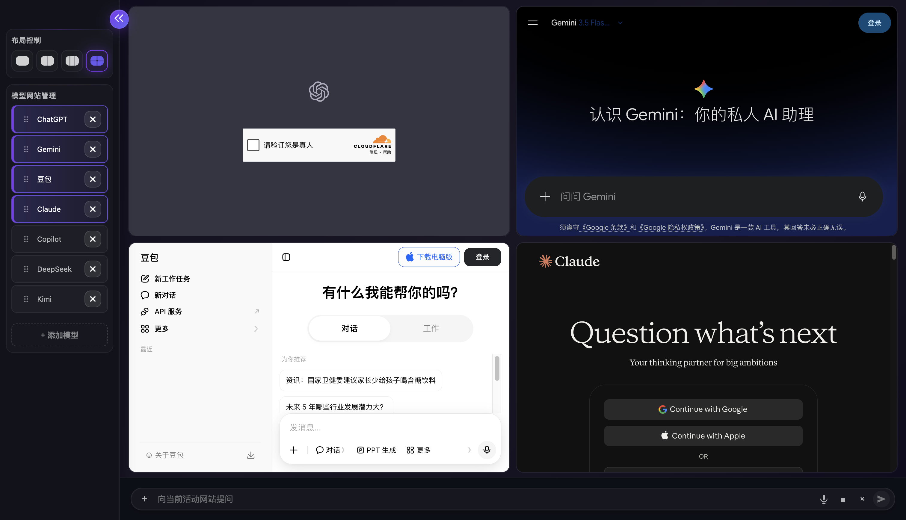
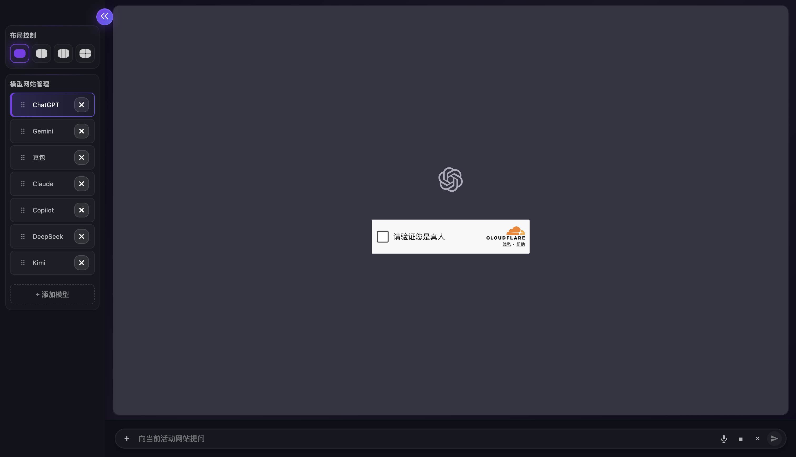
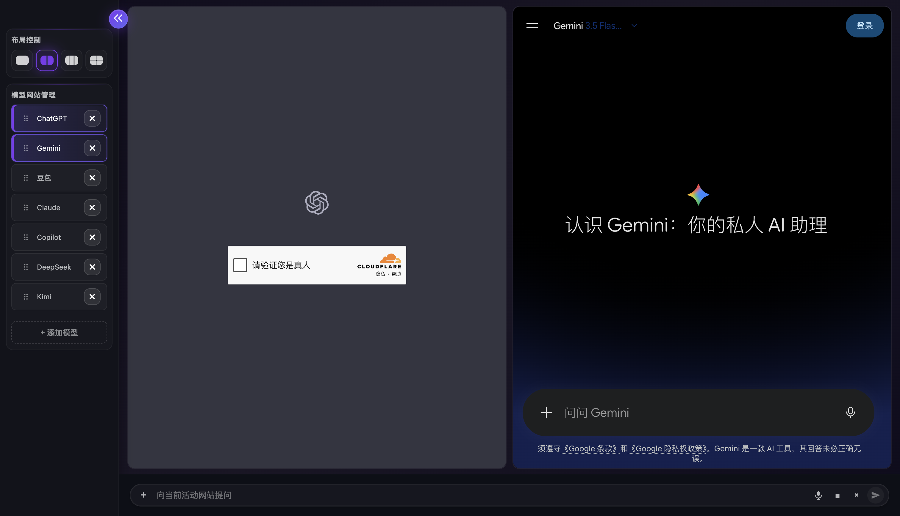
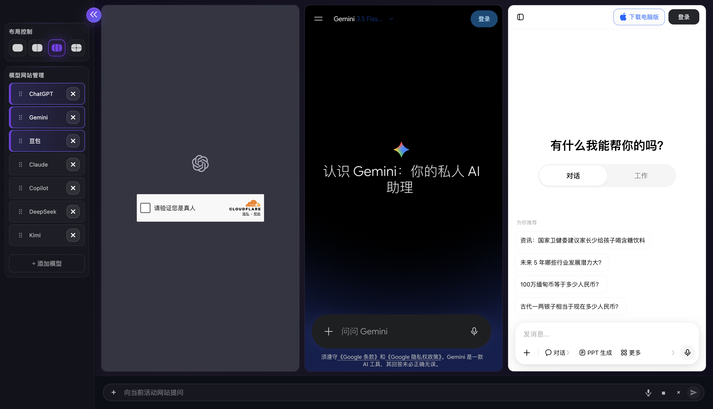

# Qask

**A private, local Electron workspace for asking the same question across multiple AI websites and comparing the answers side by side.**

> **Release status:** Qask is open source under **AGPL-3.0-or-later**. It is currently a desktop prototype: no packaged binaries are published or supported.

[](LICENSE)
[](https://www.electronjs.org/)
[](https://nodejs.org/)

[English](#overview) · [中文](#中文说明)



## Overview

Qask puts the official websites you choose in one desktop workspace. Sign in to each website yourself, select a one-, two-, three-, or four-panel layout, and send the same text to the active panels. Compare the responses directly in their original web UIs.

Qask is **not** a multi-provider API client. It does not use model APIs, extract answers, store conversation history, or create a combined answer view.

## Why Qask?

- **Compare in context** — keep each provider's own website, account, model selection, and conversation context visible.
- **One prompt, multiple sites** — use a unified composer to attempt concurrent text delivery to active panels.
- **Flexible workspace** — switch between focused, side-by-side, three-column, and 2×2 layouts.
- **Local by design** — Qask has no Git, GitHub, repository scanning, cloud sync, or provider API integration.
- **Explicit attachment handling** — images, audio, PDFs, and microphone recordings stay in a local queue; use each provider's visible upload UI to upload and send them.

## Screenshots

| One panel | Two panels |
| --- | --- |
|  |  |
| Focus on one AI website. | Compare two websites side by side. |

| Three panels | Four panels |
| --- | --- |
|  |  |
| Keep three sources visible at once. | Use a 2×2 grid for four sources. |

The screenshots were captured by the Qask maintainers in a fresh, unauthenticated Qask profile after each active third-party page reached `document.readyState === "complete"`, followed by an additional four-second settle period. They contain no account identity, user prompt, response, credential, or conversation history. The visible pages are public landing, sign-in, or verification states—some services may show an anti-bot gate—so they demonstrate loaded webviews and layout, not successful third-party message delivery or model output. Third-party UI, names, and marks remain owned by their respective providers; the screenshots are documentation-only and do not imply endorsement.

## Features

### Workspace and websites

- One, two, three, and four panel layouts; cycle layouts with `Alt + ←` / `Alt + →`.
- Built-in website entries for ChatGPT, Gemini, 豆包, Claude, Copilot, DeepSeek, and Kimi.
- Drag to reorder websites; the first *N* sites populate an *N*-panel layout without unnecessarily reloading existing pages.
- Add a custom **HTTPS** website. Custom sites are fill-only by default; automatic send requires explicit consent for that exact origin.
- A separate persistent Electron session partition per website, so website logins are isolated and typically survive an app restart on the same machine.

### Composer, attachments, and screenshots

- A shared bottom composer for the active panels: `Enter` sends, `Shift + Enter` inserts a newline.
- Local attachment queue for images, audio, and PDFs: up to 5 files and 20 MB total. Images are limited to 5 MB; audio and PDFs to 10 MB each.
- Explicit local microphone recording (up to 2 minutes); recordings become local audio attachments.
- Attachment turns are never injected or auto-sent by Qask. Choose, preview, and send files through the target website's own visible upload interface.
- Screen-region capture saved locally to `~/Pictures/Qask Screenshots/`.

### Privacy and security boundaries

- No Git, GitHub, filesystem scanning, API-key storage, cloud sync, or provider API requests.
- Qask does not read or upload repositories, `.git`, Git configuration, GitHub CLI data, SSH keys, cookies, environment files, or browser profiles.
- Only text you explicitly submit is offered to active third-party webpages. Qask validates trusted HTTPS origins before text injection.
- Remote websites run in isolated, sandboxed webviews with Node access, popups, downloads, and provider permissions denied.

Read the complete [privacy and local-data boundary](PRIVACY.md) and [security policy](SECURITY.md) before using Qask with sensitive information.

## Quick start

### Requirements

- macOS is the primary tested target.
- Node.js **22.12.0 or later** and npm.
- A **完整源码仓库 checkout** (full source checkout), including `package-lock.json` and the `test/` directory.

### Install and run

```bash
git clone https://github.com/cyk16688/Qask.git
cd Qask
npm ci
npm start
```

On first launch, sign in inside each website panel. Then select a layout, arrange the websites in the sidebar, and send a prompt from the bottom composer.

If Electron reports `spawn ENOEXEC` or attempts to use `electron.exe`, the dependencies were installed on a different platform. Reinstall them on the target machine:

```bash
rm -rf node_modules
npm ci
```

Do not modify `node_modules/electron/path.txt` or copy Electron binaries between platforms.

This repository is the supported source distribution. npm publishing is intentionally disabled (`private: true`); `npm pack` creates a **最小运行时包** for inspection only. It **不包含 `package-lock.json`、测试套件或 GUI smoke 脚本** (does not include `package-lock.json`, the test suite, or GUI smoke scripts), so it is not a standalone source distribution for development verification.

## How it works

1. **Choose your layout.** Use the sidebar or `Alt + ←` / `Alt + →`.
2. **Order websites.** Drag entries in “Model Website Management”; the first *N* populate the active *N*-panel layout.
3. **Sign in directly.** Every website remains its own web session, governed by its own terms and privacy policy.
4. **Send text.** Enter a question in the shared composer. Qask attempts to fill and, where permitted, trigger each active website's own send control.
5. **Compare on the pages.** Qask does not claim that a provider accepted a prompt or generated a response—use the actual panel content as the source of truth.

For attachments, Qask deliberately stops before provider-page automation: upload, review, and send through the visible interface of every target website.

## Development

```bash
npm test
```

Additional local UI smoke coverage is available with:

```bash
npm run test:layout-ui
```

The project uses Electron 44.3.0 and Node's built-in test runner. See [docs/architecture.md](docs/architecture.md) for the startup chain, webview isolation model, state model, IPC boundary, and known limitations.

## Current limitations

- Website adapters depend on third-party DOM structures, login state, bot checks, and service availability; a send attempt is not proof that a website accepted the message.
- Qask does not support provider APIs, streaming, answer extraction, automatic comparison, local conversation storage, or export.
- Websites may change without notice and break their text adapters.
- Using automated interaction with a provider website may be restricted by that provider's terms, account policies, or anti-bot controls; review the provider's current terms before use.
- Qask does not upload attachments to provider websites, verify uploads, or prove that a model read an attachment.
- macOS microphone and screen-capture permissions may be required for recording and screenshots.
- This source prototype still needs packaging, signing, notarization, and clean-account validation before a production desktop release.

## Documentation

- [User guide](docs/user-guide.md)
- [Architecture and development notes](docs/architecture.md)
- [Privacy and local-data boundary](PRIVACY.md)
- [Security policy](SECURITY.md)
- [Contribution guide](CONTRIBUTING.md)
- [Commercial licensing](COMMERCIAL-LICENSE.md)
- [Notices](NOTICE)
- [Release checklist](docs/release-checklist.md)

## Contributing

Contributions are welcome. Please read [CONTRIBUTING.md](CONTRIBUTING.md) and [SECURITY.md](SECURITY.md) first. Do not include credentials, browser profiles, local data, screenshots containing private content, or exploit details in public issues or pull requests.

## Security

Report vulnerabilities through [GitHub Private vulnerability reporting](https://github.com/cyk16688/Qask/security/advisories/new). Do not place secrets, cookies, private repository information, personal data, or exploit details in a public issue. See [SECURITY.md](SECURITY.md).

## License

Copyright © 2026 iCreator.

Qask is licensed under the [GNU Affero General Public License v3.0 or later](LICENSE) (**AGPL-3.0-or-later**). Commercial users may use Qask under the AGPL when they meet its terms; iCreator may offer separate commercial licensing for proprietary distribution or proprietary hosted modifications. See [COMMERCIAL-LICENSE.md](COMMERCIAL-LICENSE.md).

## Trademark notice

Qask is not affiliated with, sponsored by, or endorsed by OpenAI, Google, Anthropic, Microsoft, 字节跳动, DeepSeek, 月之暗面, or their products. Names and trademarks of third-party websites belong to their respective owners. Users are responsible for complying with the terms of each service they open.

---

## 中文说明

Qask 是一个本地 Electron 桌面工作区：把你选择的 AI 官方网页并排放在一个窗口中，通过统一输入框尝试同时发送同一问题，再直接在各网站原生界面中人工比较回答。

### 主要能力

- 支持单、双、三、四面板布局，`Alt + ← / →` 可快速切换。
- 内置 ChatGPT、Gemini、豆包、Claude、Copilot、DeepSeek、Kimi 网页入口；可拖动排序，当前布局使用前 *N* 个网站。
- 可添加**自定义 HTTPS 网页模型**；默认只填入文字，只有对精确 origin 明确授权后才会尝试自动发送。
- 每个网站拥有独立持久化 Electron 会话分区，登录状态相互隔离，通常可在本机重启后保留。
- 统一输入框可向活动面板并发尝试填入/发送文本；`Enter` 发送，`Shift + Enter` 换行。
- 支持本地图片、音频或 PDF 队列和显式麦克风本地录音，但附件不会由 Qask 自动传给第三方网页，必须在各网站可见上传界面中自行确认和发送。
- 支持本地截图，保存至 `~/Pictures/Qask Screenshots/`。

### 安装与启动

```bash
git clone https://github.com/cyk16688/Qask.git
cd Qask
npm ci
npm start
```

当前主要在 macOS 上验证，需要 Node.js 22.12.0 或更高版本。完整使用说明见 [docs/user-guide.md](docs/user-guide.md)。

### 隐私边界

Qask 不包含 Git、GitHub、目录扫描、云同步或模型 API 集成；不会扫描、读取或上传 `.git`、本地仓库、GitHub CLI 配置、SSH 密钥、Cookie、环境文件或浏览器 profile。只有你明确提交的文字才会被尝试交给活动的第三方网页。完整说明见 [PRIVACY.md](PRIVACY.md)。Qask 与 OpenAI、Google、Anthropic、Microsoft、字节跳动、DeepSeek、月之暗面及其产品**没有隶属、赞助或授权关系**。

> Qask 不是 API 聚合客户端，也尚未提供回答自动提取、对比视图、会话保存或导出。第三方网页是否接收消息、上传附件或生成回答，应以网页实际显示为准。
